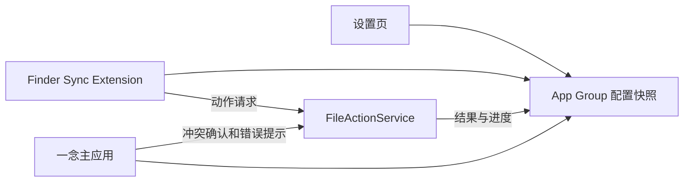

# 一念阶段四：超级右键实施计划

> 制定日期：2026-07-16
>
> 状态：已完成调研，待进入技术验证与实现
>
> 范围：Finder 右键菜单、必要文件动作、设置页配置、扩展与文件动作服务

## 1. 目标

在 Finder 的文件、文件夹和窗口空白处提供 5 个少而稳定的高频功能，并允许用户从启动器面板点击“超级右键”，直接进入专属设置页，配置功能开关、显示顺序、新建文件格式和默认终端。

首版不追求复制竞品的“大工具箱”，优先保证：

- 菜单出现快，不拖慢 Finder。
- 动作含义明确，不静默覆盖或永久删除文件。
- Finder 扩展故障不影响启动器、搜索和截图。
- 配置、剪切状态和执行结果可以跨进程可靠共享。
- 系统磁盘、外接磁盘、iCloud Drive 和常见云盘目录有明确的支持边界。

## 2. 调研结论

### 2.1 竞品现状

“超级右键-iRightMouse”当前覆盖了新建文件、剪切/粘贴、复制路径、指定应用打开、常用目录、哈希、图片转换、压缩等大量功能。其 App Store 版本记录同时反复出现以下问题：

- iCloud、OneDrive 和外接磁盘中的菜单覆盖与显示不完整。
- 菜单卡顿、扩展启用引导、选中文件获取失败。
- 剪切状态不同步、剪贴板互相影响、跨路径打开应用失败。
- 特殊字符、根目录权限和只读文件处理错误。

这说明竞争优势不应是“菜单项最多”，而应是“高频动作更稳、菜单更克制、失败可恢复”。

参考：

- [超级右键-iRightMouse App Store 页面](https://apps.apple.com/cn/app/%E8%B6%85%E7%BA%A7%E5%8F%B3%E9%94%AE-irightmouse/id1497428978?mt=12)
- [iRightMouse 官方网站](https://www.irightmouse.com/)

### 2.2 Apple 平台约束

Finder Sync Extension 可以为受监控目录提供文件菜单、空白处菜单、侧边栏菜单和工具栏菜单。扩展通过 `selectedItemURLs()` 与 `targetedURL()` 获取当前上下文；这些值只在 `menu(for:)` 和该菜单触发的 action 中可靠。

Apple 同时明确指出 Finder Sync 的原始用途是文件同步状态集成，并不鼓励把它当成任意 Finder UI 修改工具。因此实现必须保持扩展轻量：只读取上下文、构建菜单和分发动作，不在 Finder 进程相关路径中执行耗时文件操作。

主应用、Finder 扩展和 XPC 服务通过 App Group 共享配置与状态；所有进程都必须带一致的 App Group entitlement。

参考：

- [Apple Finder Sync Programming Guide](https://developer.apple.com/library/archive/documentation/General/Conceptual/ExtensibilityPG/Finder.html)
- [FIFinderSyncController](https://developer.apple.com/documentation/findersync/fifindersynccontroller)
- [Apple App Groups 配置](https://developer.apple.com/documentation/xcode/configuring-app-groups)

## 3. 首版范围

### 3.1 必须交付（P0）

| 功能 | 空白处 | 单个文件 | 单个文件夹 | 多选 | 默认状态 |
| --- | --- | --- | --- | --- | --- |
| 复制路径 | 当前目录 | 完整路径 | 完整路径 | 每行一个路径 | 开启 |
| 打开终端 | 当前目录 | 父目录 | 该目录 | 共同父目录时显示 | 开启 |
| 新建文件 | 当前目录 | 不显示 | 在该文件夹内新建 | 不显示 | 开启 |
| 新建文件夹 | 当前目录 | 不显示 | 在该文件夹内新建 | 不显示 | 开启 |
| 剪切 | 不显示 | 当前选择 | 当前选择 | 当前选择 | 开启 |

行为约定：

- 多路径复制使用换行分隔，并保留真实路径中的空格，不自动添加 shell 转义。
- “打开终端”对文件打开其父目录，对文件夹打开文件夹本身。
- “新建文件”是二级菜单，子菜单按用户设置的顺序展示已启用文件格式。
- 首版内置 TXT、Markdown、RTF、JSON、XML、YAML、CSV、HTML、Swift、Python 十种常用格式；用户可以逐项启用、停用和排序。
- 支持新增自定义文件格式。自定义项包含显示名称、扩展名和可选初始内容；扩展名必须经过格式校验，不允许包含路径分隔符或控制字符。
- 内置格式使用只读模板；需要结构的格式写入最小有效内容，普通文本格式创建空文件。
- 默认名称使用“未命名”，重名按 `未命名 2`、`未命名 3` 递增。
- 新建文件夹使用 Finder 风格的可预测重名策略。
- “剪切”在设置页中只占一个功能开关，但包含完整移动工作流。剪切后，在目标文件夹空白处或文件夹上动态显示“粘贴到此处”；没有待移动项时不显示。
- 剪切不污染文本剪贴板，文件移动状态保存在一念自己的“待移动区”。
- 同卷移动使用原子 move；跨卷使用复制、校验、删除源文件的流程。
- 冲突默认暂停，提供“跳过”和“保留两者”；首版不提供静默覆盖。
- 首版不提供“彻底删除”，删除仍由 Finder 原生能力负责。

### 3.2 Finder 右键菜单形态

参考截图红框中的表现，首版采用 Finder 原生菜单样式：

- 5 个功能直接组成一段连续菜单，不再包进“超级右键”总子菜单，减少一次点击。
- “新建文件”右侧显示子菜单箭头，展开后列出设置页中已启用的文件格式。
- “新建文件夹”“剪切”“复制路径”“打开终端”是直接动作。
- 每项使用简洁的小尺寸图标和系统菜单文字，不在 Finder 菜单中加入开关、说明文字或复杂界面。
- Finder 根据空白处、文件、文件夹和多选上下文自动隐藏不适用项，不显示大批灰色菜单。
- 这段功能区的顺序与设置页保持一致；动态“粘贴到此处”紧随“剪切”位置出现，不作为第 6 个可配置功能。

默认顺序：

1. 新建文件
2. 新建文件夹
3. 剪切
4. 复制路径
5. 打开终端

### 3.3 启动器入口与首版设置页

启动器面板中的“超级右键”卡片是配置入口，不直接执行 Finder 文件动作：

1. 用户点击“超级右键”卡片。
2. 启动器面板关闭。
3. 设置窗口打开并直接定位到“功能区 → 超级右键设置”。
4. 无论 Finder 扩展当前已启用、未启用还是通信异常，都进入同一个设置页，由页面内状态卡给出下一步操作。

“超级右键设置”包含四个区域：

“超级右键设置”改为四个区域：

1. **扩展状态**
   - 显示 Finder 扩展“已启用 / 未启用 / 通信异常”。
   - 使用 `FIFinderSyncController.extensionEnabled` 获取状态。
   - “管理 Finder 扩展”调用 `showExtensionManagementInterface()`。
   - 提供“重新检测”和最近一次通信时间。

2. **访达右键功能**
   - 只展示“新建文件、新建文件夹、剪切、复制路径、打开终端”5 项。
   - 每项可以启用/停用。
   - 支持拖拽排序。
   - 显示该动作适用的上下文，不允许用户配置出无效组合。
   - 提供“恢复默认顺序”。

3. **新建文件格式**
   - 内置格式和自定义格式使用同一个可排序列表。
   - 每种格式可以单独启用或停用；至少保留一种已启用格式，否则“新建文件”功能自动显示配置提示。
   - 内置格式不可删除，可以恢复默认内容和默认名称。
   - 自定义格式可以新增、编辑和删除。
   - 新增自定义格式使用轻量表单：显示名称、扩展名、默认文件名、可选初始内容。
   - 子菜单预览实时展示当前顺序，保存后下一次打开 Finder 右键菜单即生效。

4. **终端设置**
   - 默认终端：自动、Terminal、iTerm2、Warp，以及用户选择的应用。
   - 应用不存在时回退到系统 Terminal，并在设置页显示提醒。

### 3.4 后续版本（P1）

- 使用指定编辑器打开。
- 复制到、移动到和常用目录。
- 导入本地文件作为高级模板。
- Finder 工具栏入口。
- 移动操作历史、撤销与恢复区。
- 文件哈希（SHA-256 优先，MD5 只作兼容）。
- 显示/隐藏文件和文件扩展名。

### 3.5 明确不进入首版

- 永久删除、批量替换、修改文件权限。
- 图片格式转换、图标集、二维码、翻译。
- 压缩/解压缩和应用卸载。
- 三指轻拍、鼠标中键等全局输入拦截。
- 重复文件、相似照片和磁盘空间分析。

## 4. 技术架构



### 4.1 进程职责

**FinderExtension**

- 注册监控目录。
- 在 `menu(for:)` 内一次性读取选择和目标目录。
- 从 App Group 读取已经扁平化的只读配置快照。
- 按动作顺序和上下文构建 `NSMenu`。
- 把标准化动作请求发给文件动作服务。
- 不扫描目录、不计算哈希、不复制大文件、不弹复杂窗口。

**FileActionService**

- 校验请求版本、动作类型、URL 数量和目标位置。
- 执行新建、移动和外部应用打开。
- 处理重名、跨卷、权限、磁盘空间和取消。
- 使用结构化结果返回成功、部分成功、需要冲突决策或失败。
- 服务崩溃或超时只影响当前动作。

**主应用**

- 托管插件设置、扩展状态和诊断展示。
- 在需要用户决策时呈现冲突窗口。
- 提供绑定 `me.touch.super-right` 的作用域存储，不理解模板和动作配置的具体结构。
- 展示待移动项与最近失败，不依赖 Finder 扩展常驻。

### 4.2 共享模型

在 `SuperRightFeature` 中新增可供主应用和扩展共同使用的纯数据模型：

- `SuperRightActionID`
- `FinderMenuContext`
- `SuperRightActionConfiguration`
- `NewFileFormatDefinition`
- `SuperRightConfigurationEnvelope`
- `FileActionRequest`
- `FileActionResponse`
- `PendingMoveSnapshot`

配置必须有 `schemaVersion`。扩展遇到更高版本配置时使用内置安全默认值，不改写原数据。

当前 `SuperRightFeatureConfiguration` 的四个 Bool 仅为阶段一占位。实现时迁移为动作数组，并保留从 v1 配置读取的单向迁移：

- `opensTerminal` → `openTerminal.enabled`
- `copiesFilePath` → `copyPath.enabled`
- `cutsFiles` → `cut.enabled`，动态粘贴入口由同一剪切工作流控制
- `createsFiles` → `newFile.enabled`
- 新功能 `newFolder` 使用默认开启状态
- 新建文件格式列表使用首版内置格式初始化

### 4.3 App Group 与 IPC

建议 App Group：`group.me.touch.launcher.shared`。在开发者后台注册后，主应用、FinderExtension 和 FileActionService 使用同一 entitlement 与签名配置。

第一项技术验证必须确认 Finder 扩展能否稳定直连嵌入式 XPC Service：

1. 扩展发送 ping。
2. 服务返回协议版本和时间戳。
3. 主应用退出时重复验证自动拉起能力。
4. Finder 重启、扩展重载和 App 更新后重复验证。

若嵌入式 XPC 无法从 Finder 扩展可靠拉起，采用备选方案：App Group 原子请求队列 + 主应用无激活启动 + 主应用转交 FileActionService。不得把耗时移动操作退回 Finder 扩展内执行。

### 4.4 功能区插件边界

超级右键必须遵循 `docs/superpowers/specs/2026-07-16-feature-plugin-architecture.md`，不能以“第一方功能”为由继续增加宿主特例：

- `SuperRightFeature` 自己拥有配置类型、默认值、迁移、设置提供器和诊断摘要。
- `FeatureManifest v2` 声明 Feature API 版本、配置版本、所需 capability、执行方式和主卡片行为。
- 启动器卡片的主行为声明为 `.openSettings`，由 `FeatureHost` 通用路由，不再借用业务执行结果触发页面跳转。
- `FeatureDetailSettingsView` 只托管插件注册的设置提供器，不增加 `me.touch.super-right` 分支。
- `FeatureAreaStore` 不持有 `SuperRightFeatureConfiguration`，只持有通用插件状态和宿主偏好。
- 超级右键通过 `FeatureStorage` 访问自己的命名空间，通过 `FileActionBroker` 访问文件能力。
- FinderExtension 只接收声明式菜单贡献和标准化请求，不导入主应用视图或其他插件模块。
- 未来第三方插件不得把原生代码加载到主应用或 FinderExtension；Finder 菜单扩展只能提交声明式贡献，动作在独立进程或宿主代理中执行。

## 5. 工程改动范围

新增 Target/源码：

```text
Extensions/FinderExtension/
├── Info.plist
├── FinderSync.swift
├── FinderMenuBuilder.swift
└── FinderActionDispatcher.swift

Services/FileActionService/
├── Info.plist
├── main.swift
├── FileActionServiceDelegate.swift
└── FileActionServiceEndpoint.swift

Packages/TouchKit/Sources/
├── TouchFeatureAPI/              FeatureManifest v2、设置与 capability 协议
├── SuperRightFeature/            配置、迁移、设置提供器和菜单领域模型
├── FileActionServiceProtocol/
└── FileActionServiceCore/
```

主要修改：

- `project.yml`：增加 Finder Extension、FileActionService、依赖、嵌入关系和签名设置。
- `Packages/TouchKit/Package.swift`：增加协议、核心实现与测试 target。
- `TouchFeatureAPI`：增加版本化清单、设置提供器、作用域存储和 capability 声明。
- `TouchCore/FeatureRegistry.swift`：增加清单兼容性与能力校验，不导入具体插件类型。
- `SuperRightFeature`：接管超级右键配置、v1 → v2 迁移、App Group 发布和设置提供器。
- `TouchApp/FeatureArea/FeatureConfigurationStore.swift`：移除超级右键私有配置所有权，只保留一次性旧数据迁移入口。
- `TouchApp/Settings/FeatureDetailSettingsView.swift`：改为通用设置宿主，移除插件 ID 分支。
- `TouchApp/FeatureArea/FeatureAreaStore.swift`：移除超级右键专属 binding 与 update 方法。
- `Packages/TouchKit/Sources/SuperRightFeature/SuperRightFeaturePlugin.swift`：声明 `.openSettings` 主行为并真实检测扩展状态。
- `TouchTests`、`TouchUITests`：设置迁移、排序、状态展示与恢复默认测试。

由于上述工作会新增编译源文件、Target、Package 产品并修改 `project.yml`，正式实施前必须先提醒用户关闭 Xcode；确认关闭后才允许执行 `xcodegen generate`。后续日常编译和测试继续直接使用现有 `Touch.xcodeproj`。

## 6. 实施顺序

### 任务 0：补齐最小插件边界

- 定义 `FeatureManifest v2`：API 版本、配置版本、capability、执行隔离和主卡片行为。
- 定义第一方 `FeatureSettingsProvider` 与宿主 `FeatureSettingsHost`。
- 定义按插件 ID 自动绑定的 `FeatureStorage`。
- 将超级右键配置所有权移入 `SuperRightFeature`，宿主仅负责旧配置交接。
- 移除 `FeatureDetailSettingsView` 和 `FeatureAreaStore` 中的超级右键特例。
- 保持 V1 构建时注册第一方插件，不实现外部插件扫描或下载。

验收：宿主设置页不通过 `switch featureID` 识别超级右键；宿主不引用 `SuperRightFeatureConfiguration`；注册表能拒绝不兼容 API、重复 ID 和未声明 capability。

### 任务 1：Finder 扩展与 IPC 技术验证

- 增加最小 FinderExtension 和 FileActionService target。
- 注册 App Group 与 entitlements。
- 监控用户主目录，分别验证文件、空白处和侧边栏上下文。
- 完成扩展 → XPC ping；记录不可行时的备选路径。
- 验证扩展启用检测与系统管理界面。

验收：右键菜单可显示“超级右键（测试）”，主应用退出时 ping 仍能得到确定结果，失败时不阻塞 Finder。

### 任务 2：共享配置与菜单构建器

- 实现动作、上下文、顺序和配置 envelope。
- 完成 v1 → v2 迁移与损坏配置备份。
- 用纯 Swift `FinderMenuBuilder` 根据上下文生成菜单描述，再映射为 `NSMenu`。
- 增加空选择、单文件、单文件夹、多选、共同父目录和不支持 URL 测试。

验收：相同配置与上下文产生确定菜单；菜单构建 Release P95 小于 80ms。

### 任务 3：只读与打开动作

- 复制路径。
- 默认终端发现、选择、缺失回退和打开目录。
- 所有路径参数使用 URL API，不拼 shell 命令字符串。

验收：空格、中文、引号、换行符号和符号链接路径不造成命令注入或错误拆分。

### 任务 4：新建文件与新建文件夹

- 实现 TXT、Markdown、RTF、JSON、XML、YAML、CSV、HTML、Swift、Python 内置格式。
- 实现自定义格式的新增、编辑、删除、校验、排序和可选初始内容。
- “新建文件”按启用顺序生成二级菜单，格式配置变化在下次打开右键菜单时生效。
- 实现重名递增规则。
- 新建后通知 Finder 选中或定位结果；若系统不允许直接重命名，则只定位并使用可预测名称。
- 处理只读目录、iCloud 未下载目录和目录已消失。

验收：内置和自定义格式都能创建正确文件；本地磁盘、iCloud Drive 和外接磁盘上成功或给出可理解错误，不留下半写入文件。

### 任务 5：剪切工作流

- 在 App Group 保存待移动快照，不写系统剪贴板。
- 菜单根据待移动状态决定是否在目标文件夹动态展示“粘贴到此处”。
- “粘贴到此处”不是独立设置项，关闭“剪切”时一并停用和隐藏。
- 同卷 move；跨卷 copy → 大小/元数据校验 → 删除源。
- 冲突提供跳过、保留两者和取消；不提供默认覆盖。
- 对源文件已变化、磁盘移除、权限撤销和部分成功生成结构化结果。

验收：单文件、多文件、文件夹、跨卷、中途取消与冲突场景通过集成测试；服务崩溃不误删源文件。

### 任务 6：设置页与启用引导

- 实现扩展状态卡、5 个功能开关、拖拽排序、默认终端和文件格式设置。
- 启动器“超级右键”卡片无论扩展状态如何都直接进入专属设置页。
- `SuperRightFeaturePlugin` 通过清单声明 `.openSettings` 主行为，由 `FeatureHost` 通用导航到插件注册的设置提供器。
- 实现内置格式开关与自定义格式增删改，提供 Finder 子菜单预览。
- 配置更新通过 App Group 原子发布，Finder 菜单下次打开时生效。
- 增加 VoiceOver 标签、键盘排序替代操作和 UI 自动化标识。

验收：用户不重启主应用或 Finder 即可看到配置变化；关闭功能后菜单不再出现。

### 任务 7：兼容性、性能与发布验证

- Finder 重启、扩展禁用/启用、应用升级、服务崩溃恢复。
- 系统磁盘、用户目录、Applications、iCloud Drive、常见云盘、外接 APFS/exFAT。
- Intel 与 Apple Silicon；macOS 14、15 和当前支持的 26。
- 1000 个多选 URL 的菜单构建与请求大小上限。
- 隐私诊断默认脱敏完整路径。

验收：全部自动化测试通过，Release 菜单构建 P95 小于 80ms，空闲无持续轮询，Finder 不因服务失败卡顿或崩溃。

## 7. 测试策略

### 单元测试

- FeatureManifest v2 的 API 兼容、重复 ID、非法 capability 和主行为路由。
- `FeatureSettingsHost` 能托管任意测试插件设置提供器，不识别具体插件 ID。
- `FeatureStorage` 的插件命名空间隔离、迁移失败备份和停用保留数据。
- 上下文识别与动作可用性矩阵。
- 动作排序、默认值、v1 → v2 迁移和损坏配置恢复。
- 文件/文件夹重名生成。
- 终端应用发现与回退。
- 同卷/跨卷移动计划、冲突策略和结果汇总。
- 特殊路径、符号链接、文件包、只读卷和消失 URL。

### 集成测试

- FinderExtension ↔ FileActionService 协议版本、超时与断连。
- App Group 配置和待移动快照的多进程读写。
- 临时 APFS 卷或磁盘映像上的跨卷移动。
- 服务在复制完成前、校验后、删除源前分别崩溃的恢复行为。

### UI 与人工验证

- 扩展首次启用引导。
- 5 个功能的开关、排序、默认终端和恢复默认。
- 内置格式启停、排序以及自定义格式新增、编辑和删除。
- Finder 的空白处、文件、文件夹、多选和侧边栏菜单。
- iCloud 占位文件、外接盘拔出、权限拒绝和文件冲突提示。

## 8. 关键风险与决策门

1. **Finder 扩展覆盖范围**：`directoryURLs` 必须明确注册。首个技术验证先覆盖用户主目录，再验证 `/Volumes`、`/Applications` 和根目录的系统行为；不承诺未经验证的“全盘覆盖”。
2. **扩展直连 XPC**：这是实现隔离服务的关键风险，必须在大规模编码前完成 spike。
3. **App Group 与签名**：需要开发者后台 capability 和匹配的 provisioning profile，不能用 ad-hoc 签名验证。
4. **Mac App Store 沙盒**：当前工程未声明 App Sandbox。若目标是上架 Mac App Store，需要单独审计搜索索引、截图、Finder 文件访问和 XPC entitlement；不得在阶段四末尾才处理。
5. **iCloud 与云盘**：文件可能只有占位符，动作必须识别下载/协调状态，不能把网络等待放到菜单构建路径。
6. **剪切安全**：跨卷复制未校验成功前绝不删除源文件；首版不提供静默替换和永久删除。

## 9. 阶段完成定义

- 超级右键设置、配置和迁移归 `SuperRightFeature` 所有，宿主不持有其私有配置类型。
- 启动器通过通用 `.openSettings` 主行为进入插件设置，宿主没有超级右键 ID 分支。
- 插件清单包含 API 版本、配置版本、capability 和执行隔离方式，注册表会在加载前校验。
- 超级右键停用、配置损坏或 FileActionService 崩溃均不影响打开访达、截图、搜索和设置宿主。
- P0 五个功能按上下文正确出现并可在设置页启停、排序。
- “新建文件”二级菜单准确反映内置与自定义格式设置。
- 剪切后只在有效目标位置动态出现“粘贴到此处”，它不作为额外配置功能。
- 扩展状态、管理入口和通信诊断可用。
- FinderExtension、FileActionService 和 App Group 使用稳定 Apple Development 签名构建。
- 菜单构建 Release P95 小于 80ms。
- 文件动作失败不影响 Finder、启动器、搜索或截图。
- 剪切移动、跨卷、冲突、权限和服务崩溃场景有自动化证据。
- 文档记录支持范围、已知限制、验证机器、系统版本和构建命令。
