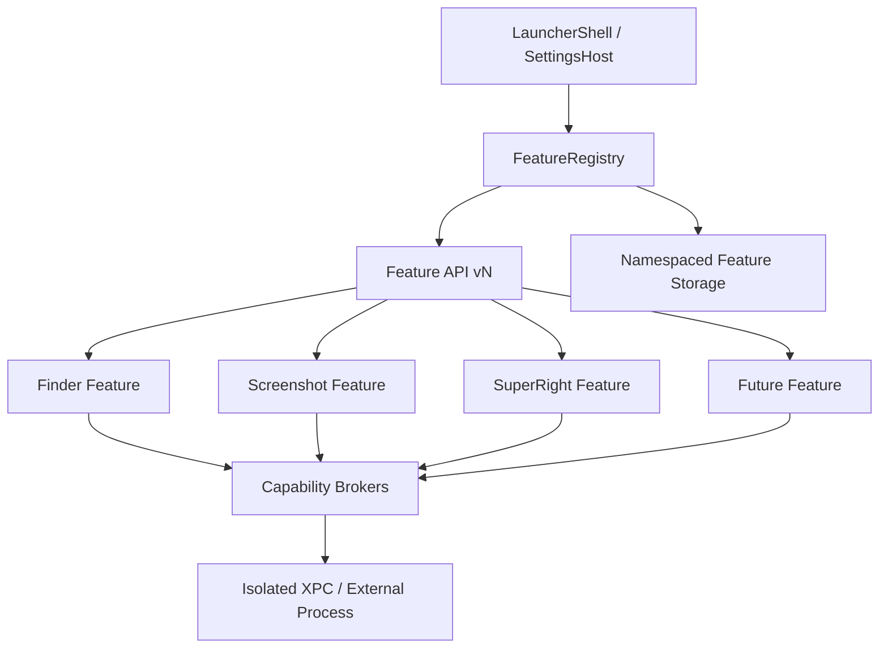

# 一念功能区插件架构规格

> 制定日期：2026-07-16
>
> 状态：架构约束已确认，V1 先实现第一方插件边界

## 1. 核心决定

“功能区”是一个稳定的宿主协议，不是主应用中的一组硬编码页面。

打开访达、截取屏幕、超级右键以及未来新增功能，都必须被视为相互隔离的功能插件。主应用只负责发现、校验、展示、导航、生命周期、权限代理、存储代理和故障隔离，不直接实现插件业务。

V1 只加载随一念一起签名发布的第一方插件，但从 V1 开始保留第三方扩展所需的版本化边界。未来插件市场不能依赖把任意 Swift 代码或动态库注入主应用；第三方能力必须采用声明式插件，或由独立签名进程通过受控 IPC 接入。

## 2. 目标与非目标

### 2.1 目标

- 任一功能插件可以独立启用、停用、升级、迁移和故障恢复。
- 插件只能访问自己声明且用户允许的能力。
- 插件设置、数据、日志和后台服务以插件 ID 为隔离边界。
- 删除一个插件后，启动器、搜索和其他插件继续正常工作。
- 主应用不需要通过 `switch featureID` 才能展示插件设置。
- 宿主协议可以演进，并能拒绝不兼容插件而不崩溃。
- Finder、截图、文件操作等高权限能力由宿主代理，不把权限直接扩散给所有插件。
- 为未来第三方插件目录和功能区市场预留安全的分发模型。

### 2.2 V1 非目标

- 不从网络下载或运行第三方原生代码。
- 不扫描任意目录加载 Swift Bundle、Framework 或 dylib。
- 不允许插件替换启动器搜索、主题、更新、安全策略等核心能力。
- 不开放第三方代码直接进入 Finder Sync Extension。
- 不在超级右键阶段实现完整插件商店、账号、支付、审核和远程更新。

## 3. 当前实现评估

现有 `FeaturePlugin`、`FeatureManifest` 和 `FeatureRegistry` 已经提供第一层抽象，但仍属于“编译期模块化”，尚未达到可插拔架构：

1. `FeatureManifest` 只有名称、图标、排序和快捷键，没有 API 版本、能力声明、设置描述、数据版本和执行隔离信息。
2. `FeaturePlugin` 只有 `initialState()` 与 `perform()`，无法描述多个命令、权限、健康检查、设置入口和迁移。
3. `FeatureDetailSettingsView` 根据插件 ID 硬编码设置页面。
4. `FeatureConfigurationStore` 与 `FeatureAreaStore` 直接持有截图、访达和超级右键的具体配置类型。
5. 主应用直接导入多个功能模块，功能配置改变时需要修改宿主代码。
6. 当前注册表只接收启动时传入的 Swift 实例，没有来源、签名、兼容性和能力校验层。

这些问题不会阻止 V1 第一方功能运行，但如果继续沿用，第三方插件会迫使主应用不断加入特例。因此超级右键实现前必须先补齐最小插件边界。

## 4. 分层架构



### 4.1 宿主核心

宿主可以知道：

- 插件 ID、协议版本、显示元数据和兼容范围。
- 卡片主动作与设置描述。
- 插件声明的能力、权限状态和健康状态。
- 插件启停、排序、可见性和快捷键。
- 插件占用的存储空间与可清理数据类别。

宿主不应知道：

- 超级右键有哪些具体文件格式。
- 截图有哪些标注参数。
- 某个插件如何组织自己的配置结构。
- 插件私有数据库表、文件路径或业务错误枚举。
- 插件如何连接自己的执行服务。

### 4.2 功能插件

每个插件负责：

- 提供版本化清单和主动作。
- 提供宿主可渲染的设置描述，或第一方受控设置提供器。
- 管理自己的配置模型、默认值与迁移。
- 把高权限请求转换成宿主能力调用。
- 提供健康检查、诊断摘要和恢复默认操作。
- 在停用时释放自己的热键、监听器、XPC 连接和临时状态。

### 4.3 能力代理

文件访问、屏幕录制、辅助功能、网络、剪贴板、通知和外部应用启动等能力不直接暴露为全局对象，而由宿主提供最小化代理：

- `FileActionBroker`
- `ScreenCaptureBroker`
- `PasteboardBroker`
- `ApplicationLaunchBroker`
- `NotificationBroker`
- `NetworkBroker`（未来）

代理根据插件清单、用户授权和当前请求进行三次校验。插件未声明的能力即使宿主拥有权限也不可调用。

## 5. 版本化插件协议

### 5.1 FeatureManifest v2

清单至少包含：

- `id`：反向域名格式，永久稳定。
- `displayName`、`summary`、`icon`、`defaultOrder`。
- `pluginVersion`。
- `featureAPIVersion`。
- `minimumHostVersion`、`maximumTestedHostVersion`。
- `configurationSchemaVersion`。
- `capabilities`：必需能力与可选能力。
- `executionMode`：宿主内轻量逻辑、XPC 服务、独立应用或声明式工作流。
- `primaryAction`：启动器卡片点击后的行为。
- `settingsPresentation`：无设置、声明式设置或第一方设置提供器。
- `diagnosticsPolicy` 与数据清理类别。

注册表必须在加载前验证 ID 唯一性、API 兼容性、最低系统版本、能力合法性和清单完整性。

### 5.2 生命周期

统一生命周期：

1. `validate`
2. `prepare`
3. `enable`
4. `performPrimaryAction`
5. `disable`
6. `reset`
7. `uninstall`（未来）

每一步都必须可超时、可取消并返回结构化错误。`disable` 必须幂等，插件不得假设自己永远常驻。

### 5.3 设置协议

设置页面不能继续由宿主按插件 ID 硬编码。

V1 支持两种设置来源：

1. **第一方设置提供器 `FeatureSettingsProvider`**：视图工厂由插件模块注册，宿主只提供主题令牌、导航容器和插件作用域服务。
2. **声明式设置描述**：插件返回 Toggle、Picker、可排序列表、文本字段和 Action 等标准控件模型，由宿主统一渲染。

未来第三方插件只允许使用声明式设置，或打开插件自己的独立签名应用。不得把第三方 `AnyView`、SwiftUI 类型或动态原生视图加载进一念进程。

### 5.4 存储协议

宿主提供 `FeatureStorage`，调用时自动绑定插件 ID：

```text
Application Support/Touch/Features/<plugin-id>/
UserDefaults suite: me.touch.features.<plugin-id>.*
```

规则：

- 插件拿不到其他插件目录 URL。
- 配置写入使用带 schemaVersion 的 envelope。
- 迁移失败只隔离当前插件，并保留原数据备份。
- 宿主只读取通用元数据，不反序列化插件私有配置。
- 重置与卸载必须明确区分；停用默认保留数据。
- 第一方 App Extension 和 XPC 可以通过 App Group 访问经过授权的共享快照；未来第三方独立进程只能通过 `FeatureStorage` IPC 访问逻辑存储，不能获得一念容器的物理路径。

## 6. 运行与故障隔离

### 6.1 进程边界

- 卡片元数据、轻量状态和设置描述可以在宿主内运行。
- 文件移动、截图、OCR、压缩、网络抓取等耗时或高权限任务必须在 XPC 或独立进程运行。
- 每个高风险功能优先拥有独立服务，不能把所有插件塞进一个万能后台进程。
- 插件通过版本化请求模型访问服务，不传递任意闭包或宿主对象。

### 6.2 故障策略

- 单插件超时只标记该插件故障。
- 单插件配置损坏只重置或隔离该插件配置。
- XPC 崩溃由对应插件有限次数重连，不重启整个应用。
- 连续失败触发熔断，用户手动重试后再恢复。
- 插件停用后不再接收事件、菜单请求或后台任务。
- 宿主保留最低可用能力：启动器、设置、安全控制和插件卸载入口。

## 7. 超级右键作为插件的边界

`SuperRightFeature` 必须完整拥有：

- 五个首版功能的动作描述和默认顺序。
- 内置及自定义文件格式模型。
- Finder 菜单上下文规则。
- 配置 schema、迁移和设置提供器。
- Finder 扩展状态、健康检查和诊断摘要。
- `FileActionService` 客户端与结构化错误映射。

主应用只负责：

- 展示“超级右键”卡片。
- 点击后托管其设置页面。
- 提供插件作用域存储、权限和能力代理。
- 根据通用状态展示“可用、受限、故障、停用”。

Finder Sync Extension 是超级右键的系统适配器，不是通用第三方代码宿主。未来其他插件想向 Finder 菜单添加能力时，只能提交声明式 `FinderMenuContribution`：

- 稳定 action ID。
- 菜单名称与图标标识。
- 支持的选择上下文。
- 所需宿主能力。
- 结构化参数 schema。

Finder 扩展根据已审核贡献构建菜单，实际动作仍由宿主代理或插件独立进程执行。第三方代码绝不在 Finder 扩展进程中运行。

## 8. 第三方插件与市场演进

### 8.1 分发约束

如果一念通过 Mac App Store 分发，不能把“插件市场”设计成下载并执行新的原生 Swift 代码。可选模式只有：

1. **声明式插件**：下载经过签名的 JSON/资源包，由宿主解释固定能力。
2. **独立应用连接器**：第三方发布自己的签名、公证应用，通过公开 XPC、App Intent 或 URL 协议接入。
3. **服务型插件**：远程服务通过严格网络 API 提供数据，宿主仍控制本地权限。

如果未来采用官网直接分发，可以允许安装签名、公证的外部插件包，但仍必须在独立进程运行，不能使用 `dlopen` 把第三方代码加载进主应用。

分发路线必须在建设市场前明确；不能先实现原生插件下载，再尝试适配 Mac App Store 规则。

### 8.2 市场最小模型

未来市场条目包含：

- 插件 ID、开发者身份和签名指纹。
- 版本、Feature API 兼容范围和系统要求。
- 能力与权限清单。
- 设置 schema 与数据使用说明。
- 包哈希、审核状态、更新通道和撤销状态。
- 用户评分、价格和许可证只属于市场层，不进入运行时协议。

安装前必须展示能力差异；插件更新新增权限时必须重新确认。市场或本地安全策略可以撤销插件，撤销后保留用户数据并停止执行。

## 9. 分阶段落地

### V1：第一方可插拔边界

- FeatureManifest v2 与兼容性校验。
- 插件拥有自己的配置、设置提供器和迁移。
- 宿主移除按插件 ID 硬编码的设置分支。
- 插件作用域存储和能力声明。
- 截图与超级右键使用独立 XPC 服务。
- 注册来源仍是应用构建时的第一方组合根。

### V1.x：声明式扩展试验

- 声明式设置 schema。
- 声明式卡片动作和有限能力代理。
- 本地开发者模式加载无执行代码的测试包。
- 插件兼容性、撤销和诊断工具。

### 市场阶段

- 确定 Mac App Store 或官网分发路线。
- 开发者签名、审核、目录、安装、更新和回滚。
- 独立应用连接器或声明式插件正式开放。
- 权限变更审计、远程撤销和安全响应流程。

## 10. 验收门槛

- 删除任一第一方插件的组合根注册后，宿主仍可编译，且不需要删除对应 `switch featureID` 分支。
- 插件 A 无法读取插件 B 的配置和文件目录。
- 插件设置损坏、迁移失败、XPC 崩溃和超时均不影响其他插件。
- 重复 ID、不兼容 API、非法 capability 和未知设置类型在加载前被拒绝。
- 插件停用后，其菜单、快捷键、监听器和后台连接全部释放。
- 宿主核心不导入具体插件的配置类型。
- 第三方插件模型不要求在主应用或 Finder 扩展中运行第三方原生代码。

## 11. 禁止的实现方式

- 在 `FeatureDetailSettingsView` 中继续增加新的插件 ID 分支。
- 在 `FeatureAreaStore` 中继续增加插件专属配置属性和更新函数。
- 使用共享 `UserDefaults.standard` 存放所有插件私有设置。
- 让插件直接持有主应用 `AppDelegate`、窗口控制器或其他插件实例。
- 让 Finder 扩展直接执行长时间文件操作或加载第三方代码。
- 用一个无边界的 XPC 服务执行所有插件任务。
- 以“现在都是第一方”为理由跳过 API 版本、配置版本和能力声明。
