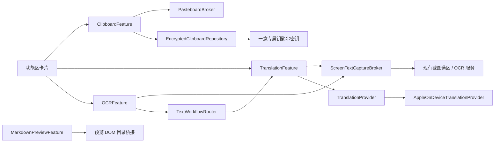

# 一念功能工作台、剪贴板、离线翻译与 OCR 设计规格

> 制定日期：2026-07-20
> 状态：已实施；验收记录见 `docs/verification/2026-07-21-feature-workspaces-clipboard-translation-ocr.md`
> 范围：Markdown 目录抽屉、剪贴板历史、截图优先的翻译与 OCR 工作台

> 2026-07-22 视觉与工作流增补：采用三个独立工作台共用统一视觉壳层的方案 A，并新增完整的“石墨灰”主题。

> 2026-07-23 文字识别精修增补：文字识别结果窗口改为上方截图预览、下方可编辑识别内容；自动复制由文字识别设置控制，默认开启；剪贴板日期统一使用中文年月日。

## 1. 核心决定

本轮采用“独立插件 + 受控共享能力”的方案：

- 在现有 Markdown 插件中增加仅基于预览内容的目录抽屉；不改写 Markdown 源文件。
- 新增 `ClipboardFeature`、`TranslationFeature`、`OCRFeature` 三个第一方功能区插件。
- 翻译与 OCR 不直接互相读取或修改状态。它们通过宿主提供的截图/OCR 代理及一个版本化的文本工作流请求传递数据。
- 翻译与 OCR 的默认入口都是“先截图选区、再识别、最后打开结果窗口”，而不是打开空白文本编辑器。
- 翻译首版只使用 Apple Translation 框架的本机能力和系统管理的语言包；macOS 14 及更低版本显示受限状态，绝不悄悄切换到网络服务。
- 剪贴板历史保存文本和图片；包括密码、验证码等敏感内容。所有条目以应用专属钥匙串密钥进行本地加密，不读取、修改或影响其他钥匙串项目。

本设计遵循现有《功能区插件架构规格》：插件负责领域逻辑、配置、数据和健康状态；主应用只负责功能区入口、窗口托管、权限代理、导航和故障隔离。

## 1.1 2026-07-22 方案 A 改版决定

- 剪贴板历史改为纵向单列大卡片。文本卡片保持紧凑，图片卡片提供约 180–240pt 的等比预览，优先让用户辨认图片内容；单击卡片主体即复制，不再保留单独的复制按钮。收藏和删除操作在悬停时出现，收藏状态始终可见。
- 复制成功后在窗口正中央显示主题化“已复制”浮层，使用勾选图标、短时淡入淡出和清晰的 VoiceOver 提示；普通状态栏不重复显示复制成功。
- 翻译与 OCR 继续使用独立普通功能区窗口，但共享标题区、全量主题背景、图标按钮、状态提示和间距体系。标题栏安全区、滚动区域、编辑器和弹层不得露出系统默认白色或浅灰背景；石墨灰主题下整个窗口均为石墨灰语义表面。
- 两个截图文字入口都必须先进入全屏透明选区，用户只能框选需要处理的局部区域；鼠标松开且选区有效后立即提交，不显示确认工具栏。随后自动 OCR，翻译入口还必须自动发起翻译，不再打开空白窗口或要求第二次点击开始；`Escape` 始终可取消。
- 翻译窗口采用左右双栏：左侧为可编辑原文，右侧为译文；原文语言自动检测，目标语言手动选择，支持交换、重新翻译和两侧分别复制。
- OCR 窗口采用“上方本次选区截图、下方可编辑识别文字”的纵向结构，不显示截图路径；截图只以内存预览服务当前窗口，不进入截图历史。窗口提供重新框选、复制、翻译和清空图标动作，OCR 转翻译直接传递当前校对文本，不再次截图。
- 新增第四套独立“石墨灰”主题，不替换默认玻璃、黑夜或白天。主背景使用非纯黑中性深灰，卡片与输入区稍亮，强调色使用清晰但克制的蓝色。该主题必须覆盖启动器、设置和全部功能区，而非只覆盖本轮三个工作台。
- Apple Translation 检测到目标语言包未安装时，先在翻译面板内显示中文说明和“下载语言包”动作；只有用户明确点击后才允许系统发起语言包下载确认。macOS 14 继续显示受限状态，不联网降级。

## 1.2 2026-07-23 文字识别精修决定

- “OCR 工作台”的产品显示名称统一为“文字识别”。结果窗口参考目标图使用约 `390 × 252pt` 的紧凑默认尺寸，并保留 macOS 原生红、黄、绿窗口按钮。
- 内容区采用上下布局：上方按比例展示本次框选区域，下方展示可编辑识别文字。预览数据只驻留当前窗口内存；截图服务的临时 artifact 在识别成功、失败或取消后均删除，不形成 OCR 历史或永久截图。
- “识别后自动复制”是文字识别插件设置项，默认开启。开启时识别成功后写入系统剪贴板，并在窗口中部短时显示“拷贝成功”；关闭时既不自动写入剪贴板，也不显示自动复制提示。底部手动“拷贝”动作始终可用，复制成功后同样显示提示。
- 清空识别文字不清空本次截图预览；重新框选成功后同时替换预览和识别文字。将识别文字交给翻译时使用用户当前校对后的内容，且不发起第二次截图。
- 剪贴板条目日期统一使用 `yyyy年M月d日`，例如 `2026年7月23日`，不混入时分秒或英文月份。

## 2. 目标与非目标

### 2.1 目标

- Markdown 预览拥有可推拉的左侧目录，支持 H1–H6、点击跳转和阅读位置高亮。
- 用户可在功能区管理文本/图片剪贴板历史，搜索、复制、收藏和清空内容。
- 翻译从屏幕选区中的文字开始，自动识别原文语言，用户手动选择目标语言，并展示清晰的原文/译文结果。
- OCR 从屏幕选区中的文字开始，打开上方展示选区截图、下方编辑识别文字的紧凑校对窗口，可复制、重新截图或把校对后的文本交给翻译。
- 翻译、OCR、剪贴板和 Markdown 均复用默认玻璃、黑夜、白天、石墨灰四套主题的语义令牌，不能暴露默认 SwiftUI/AppKit 按钮、菜单或输入框外观。
- 为未来云端翻译和大模型翻译保留 Provider 边界，但本轮不发起网络请求、不添加云端密钥配置。

### 2.2 非目标

- 不为图片剪贴板首版做图片内文字检索或图片分类；图片按类型、时间、收藏状态展示和筛选。
- 不保存 OCR 识别历史或永久截图。允许当前“文字识别”窗口持有一份本次选区的内存预览；截图服务中的临时识别图像必须在成功、失败或取消后删除。
- 不将翻译结果自动写入剪贴板历史；用户点击复制后才按现有剪贴板监听规则进入历史。
- 不在 macOS 14 上接入网络翻译作为自动降级，也不模拟或自带 Apple 语言包。
- 不改变现有截图编辑、标注、钉图和普通截图保存流程。

## 3. 用户工作流

### 3.1 Markdown 目录

1. 用户在 Markdown 阅读或分栏模式点击“目录”图标。
2. 左侧抽屉从内容边缘推入；目录由当前预览 DOM 中已渲染的 H1–H6 提取，保留层级与文案。
3. 用户点击条目后，预览滚动到对应标题。预览滚动时，当前可见标题高亮。
4. 用户关闭抽屉后，内容区恢复完整宽度；本次 Markdown 窗口会话内保留抽屉开关状态。
5. 编辑模式没有可见预览时，不从源 Markdown 解析目录；目录按钮显示受限状态和“切换到阅读或分栏模式以查看目录”的悬浮说明。

目录只读取预览渲染结果和锚点，不回写、不格式化、不插入锚点、不修改原文件。

### 3.2 截图优先的翻译

1. 用户点击“翻译”功能区卡片；启动器隐藏，并进入临时截图选区。
2. 用户拖出有效选区并松开鼠标后立即完成选择，宿主调用既有 OCR 能力识别文字；不再显示需要二次点击的确认工具栏。临时图像只为本次请求保留，识别结束后删除。
3. 有文字时打开翻译结果窗口；没有文字或 OCR 失败时在原流程中给出重试/取消，不留下空白翻译窗口。
4. 结果窗口上部显示原文，中部显示“自动检测的原文语言 → 手动选择的目标语言”及交换入口，下部显示译文。
5. 每个文本区使用紧凑图标动作（复制、朗读、展开等）；动作必须有工具提示、VoiceOver 标签和键盘可达焦点。常用操作不依赖常驻文字按钮。
6. 更换目标语言或点击翻译后重新请求；用户可复制任一文本区的内容。
7. 当语言对受系统支持但语言包尚未安装时，窗口内显示中文下载说明；用户点击“下载语言包”后再交由 macOS 显示系统下载确认并完成准备。

译文不改变 OCR 原文。用户关闭窗口或取消任务时，正在进行的翻译必须可取消。

### 3.3 文字识别（OCR）工作台

1. 用户点击“文字识别”功能区卡片；入口同样首先打开临时截图选区，拖出有效区域并松手后立即识别。
2. OCR 完成后打开约 `390 × 252pt` 的“文字识别”结果窗口。窗口上方按比例展示本次选区截图，下方展示可编辑识别文字；预览只存在于当前窗口内存。
3. 若“识别后自动复制”开启，识别成功后立即写入剪贴板，并在窗口中部短时显示“拷贝成功”；关闭设置时不自动复制、不显示该自动提示。
4. 用户可直接校对文字，手动拷贝，点击“翻译”后把校对后的文本传给翻译窗口，点击“重新框选”替换当前结果，或清空文字。手动拷贝成功后同样显示“拷贝成功”，清空文字时保留截图预览。
5. 翻译窗口取得文本后不重新截图；它沿用翻译窗口的语言选择、下载状态、错误状态和图标操作。
6. 截图服务的临时 artifact 在 OCR 成功、失败和取消后删除；关闭窗口时释放内存预览和本次 OCR 结果，默认不写入 OCR 历史。

### 3.4 剪贴板历史

1. `ClipboardFeature` 启用时监听通用剪贴板变更，采集文本或图片；连续相同内容去重。
2. 新条目写入加密本地仓库；普通历史最多保留 100 条，按最久未收藏条目淘汰。收藏条目不自动淘汰，作为独立的长期保留集合。
3. 剪贴板窗口按时间展示文本和图片；日期使用 `yyyy年M月d日` 中文年月日格式；用户可搜索文本、按“图片”类型筛选、复制、收藏/取消收藏、删除单项或清空全部历史。
4. 密码和验证码与其他文本同等保存，不做内容过滤或隐藏。清空全部、删除单项与取消收藏必须立即生效。
5. 由本插件执行的复制操作必须避免被监听器再次作为重复条目写入。

图片采用原始位图的受控 PNG/HEIC 表示或可恢复的粘贴板数据，不保存外部文件路径。列表只按需解密/解码缩略图，避免加载大量图片导致功能区卡顿。

## 4. 视觉与窗口规范

### 4.1 共通原则

- 使用 `TouchApp/Appearance` 的面板、文字、图标、交互、透明度回退和动效令牌；默认高级玻璃、黑夜、白天主题都必须完整可用。
- 功能区窗口继续使用 macOS 原生红黄绿按钮，且 `isMovableByWindowBackground = false`；只有顶部原生标题栏可拖动。
- 打开功能窗口时隐藏启动器；关闭窗口后恢复启动器；不通过永久更高的窗口层级改变原生前后关系。
- 所有图标按钮有悬浮提示、VoiceOver 标签、可见键盘焦点与按下状态。减少动态效果时移除位移/缩放；降低透明度时使用不透明回退表面。
- 可编辑文本保留 `Command+C`、`Command+V`、`Command+A`，窗口与全局快捷键不得抢占这些组合键。

### 4.2 翻译与 OCR 结果窗口

翻译界面参考用户提供的速译布局的信息结构，而非复用其品牌或视觉资产：

- 原文和译文为上下两段内容区，中间是两端语言选择与交换控件。
- 语言选择使用主题胶囊样式；原文语言默认显示“自动：<识别结果>”，目标语言为用户主动选择。
- 文本区顶部/右侧使用一组图标操作，文字说明仅经悬浮提示、辅助功能和焦点提示出现。
- 识别过程中显示主题化进度状态，不能显示旋转的默认系统控件。
- 文字识别窗口采用同样的密度和操作语言，使用上方选区截图预览、下方可编辑文字的纵向结构，并在底部提供重新框选、翻译、清空和拷贝操作；自动或手动复制成功提示居中覆盖内容，但不推动布局。

### 4.3 Markdown 目录抽屉

- 目录抽屉位于预览左侧，不遮挡窗口的原生标题栏和模式切换区。
- 条目按标题级别缩进；活动标题同时使用文字权重、背景/形状和颜色区分，不能仅靠颜色。
- 抽屉使用主题面板与轻边界、柔和阴影建立层级；宽度固定在可读范围，收起与展开使用主题定义的短动效。

## 5. 架构与模块边界

### 5.1 插件与宿主

| 模块 | 责任 | 不负责 |
| --- | --- | --- |
| `MarkdownPreviewFeature` | 预览目录模型、抽屉状态、预览跳转/滚动桥接 | 修改 Markdown 源内容 |
| `ClipboardFeature` | 剪贴板监听、去重、收藏、搜索、加密历史仓库 | 访问其他插件数据、读取其他钥匙串项 |
| `TranslationFeature` | 截图翻译工作流、语言选择、Provider 状态、翻译结果 UI | 直接调用 OCR 插件状态、云端翻译 |
| `OCRFeature` | 截图识别工作流、文字校对、复制、转交文本 | 保存截图/OCR 历史、直接持有翻译窗口 |
| `ScreenTextCaptureBroker` | 临时截图、OCR、取消、权限/服务错误映射 | 保存普通截图、展示插件业务窗口 |
| `TextWorkflowRouter` | 版本化地把用户确认后的纯文本请求路由给翻译插件 | 传递位图、共享可变插件状态 |
| `FeatureWindowHost` | 隐藏/恢复启动器、托管窗口、关闭恢复和原生窗口约束 | 解释插件的领域数据或 Provider 错误 |

插件之间只能传递 `TextTranslationRequest`（文本、可选识别语言、来源、请求 ID），不能传递截图文件、视图模型、窗口控制器或彼此的存储对象。

### 5.2 翻译 Provider

`TranslationProvider` 定义支持语言、语言对状态、准备/下载、翻译和取消的异步接口；领域层只消费稳定的 Provider 结果与错误枚举。

首版只注册 `AppleOnDeviceTranslationProvider`：

- 仅在 `#available(macOS 15.0, *)` 的实现分支中访问 Translation 框架；macOS 14 上 Provider 返回 `.requiresMacOS15`。
- 使用 `LanguageAvailability` 检查语言及语言对状态：已安装可直接翻译、支持但未安装时由系统负责显示下载确认、未支持时提示用户更换语言。
- 使用 `TranslationSession` 的自定义翻译 API，以便保留“一念”的结果窗口和图标操作，而非展示系统默认翻译浮层。
- 文本内容在设备上处理；不会因为语言包缺失自动调用网络翻译。Apple 文档表明 TranslationSession 的翻译在设备上处理，且可由系统请求下载所需语言。¹

后续可增加 `CloudTranslationProvider` 与 `LLMTranslationProvider`，但必须在设置中显式选择、声明网络与数据用途、独立管理凭据、取得用户同意，并且不能改变首版默认的本地离线行为。

### 5.3 临时截图与 OCR

现有截图服务新增或复用一个“临时文本捕获”意图：

- 使用已有屏幕录制权限、选区和 OCR 服务，不复制屏幕捕获实现。
- 捕获文件放入受控临时位置，仅在 OCR 请求完成/取消/超时前有效；不进入截图历史、钉图、导出或普通缩略图流程。
- XPC 请求仍使用版本化 `Codable` 信封，客户端有超时、取消、有限重试和服务失效隔离。
- OCR 返回空文本、权限缺失、服务不可用、用户取消、图像不支持时均映射为可恢复的插件状态，不影响其他插件。

### 5.4 加密剪贴板仓库

`EncryptedClipboardRepository` 是 `ClipboardFeature` 的私有数据边界：

- 首次启用时生成随机对称密钥，并只在钥匙串中新建该应用专属、`ThisDeviceOnly` 的密钥项目；不枚举、读取、删除或覆盖其他应用的钥匙串记录。
- SQLite 只保存条目 ID、排序所需的最小非敏感索引；文字、图片数据、显示摘要和搜索内容封装为单个加密载荷。密钥不写入 `UserDefaults`、文件或日志。
- 采用经认证加密；解密失败、密钥不可用或数据库损坏时隔离本插件的历史库、提示用户清除并重新开始，不能导致启动器或其他插件失败。
- 搜索在内存中解密最多 100 条普通记录和收藏记录后完成；不创建明文全文索引。图片条目以“图片”类型标签参与筛选，不对图片内容做 OCR 搜索。
- 监听器和写入器在独立执行上下文运行；UI 只消费已解密的有界快照，图片缩略图惰性解码并受缓存上限约束。

## 6. 配置、权限与存储

### 6.1 设置

各插件通过自己的设置提供器暴露配置，宿主不增加 `switch featureID` 分支：

| 插件 | 设置项 |
| --- | --- |
| Markdown | 目录抽屉默认显示状态（只影响新会话；窗口内状态即时生效） |
| 剪贴板 | 历史启停、普通历史上限 100、清空历史、清空收藏、存储状态和恢复入口 |
| 翻译 | 默认目标语言、当前 Provider（首版固定为 Apple 离线）、已支持/待下载/不可用语言摘要 |
| OCR | OCR 状态摘要、重新检测入口、“识别后自动复制”（默认开启）；不提供历史保留开关 |

### 6.2 权限与系统要求

- 翻译：macOS 15+ 才可用。在 macOS 14，功能区卡片与详情页显示“需要 macOS 15 才能使用系统离线翻译”，并提供系统要求说明；不显示假成功或网络回退。
- 截图翻译与 OCR：依赖屏幕录制权限；所有授权、恢复、重检和跳转系统设置都在“设置 → 权限”完成。功能窗口只显示状态摘要和“前往权限设置”入口。
- 剪贴板监听不申请屏幕录制或辅助功能权限；其敏感数据写入由用户已确认的功能行为和本地加密保护。

### 6.3 目录与保留

- 插件配置和数据库采用独立命名空间 `Application Support/Touch/Features/<plugin-id>/`。
- 临时 OCR 图片位于服务受控的临时目录，识别成功、失败或取消后删除，不纳入任何插件长期存储；结果窗口仅保留解码后的内存预览直到窗口关闭。
- 剪贴板普通历史保留 100 条；收藏项不自动淘汰。清空普通历史不清空收藏，清空全部会删除两者并安全删除加密数据库内容；密钥只有在用户明确重置剪贴板插件数据时才删除。

## 7. 状态、错误与恢复

| 场景 | 用户看到的状态 | 恢复行为 |
| --- | --- | --- |
| macOS 14 打开翻译 | “需要 macOS 15”受限页 | 保留关闭与查看要求入口，不自动联网 |
| 语言包未安装 | 目标语言旁显示“需要下载” | 用户主动触发后由系统请求下载确认 |
| 语言对不支持 | 明确提示不支持 | 更换目标语言 |
| OCR 无文字 | 空结果说明 | 重新截图 |
| 截图权限缺失 | 受限说明 | 前往统一权限页、重新检测 |
| OCR/XPC 超时 | 本次任务失败 | 重试；连续失败只隔离对应插件 |
| 翻译取消或失败 | 原文保留、译文区域显示可恢复错误 | 重试或切换语言 |
| 剪贴板库/密钥不可用 | 剪贴板插件受限，其他功能正常 | 在设置中清除并重建该插件数据 |
| 剪贴板达到普通历史上限 | 自动淘汰最旧未收藏项 | 收藏项不被自动删除 |

所有失败信息不得写入日志中的原文、译文、OCR 文字、密码、验证码或图片数据。

## 8. 测试与验收

### 8.1 TouchKit 单元测试

- 三个插件的 manifest、能力声明、独立启停和注册表故障隔离。
- `TranslationProvider` fake：macOS 14 受限、语言对已安装/待下载/不支持、取消、错误映射和未来 Provider 可替换性。
- `TextWorkflowRouter` 只传递纯文本请求，OCR 到翻译不触发第二次截图。
- 剪贴板：文本/图片编码、重复去除、100 条淘汰、收藏保留、删除/清空、复制回写防重入、加密解密、密钥缺失和损坏库恢复。
- Markdown 目录模型：H1–H6 层级、重复标题稳定锚点、空标题过滤、活动标题选择和编辑模式受限状态。

### 8.2 主应用与 UI 测试

- 功能区卡片、窗口开闭时启动器恢复、窗口不可通过背景拖动、四个主题下的视觉状态。
- 翻译截图入口、文字识别截图入口、上方截图预览与下方编辑区、`390 × 252pt` 紧凑默认尺寸、OCR→翻译文本交接和图标工具提示/VoiceOver 标识。
- 文字识别自动复制默认开启、设置持久化、关闭时不写剪贴板且不显示自动提示、手动复制始终可用，以及复制成功浮层的显示与自动消失。
- 可编辑 OCR 与翻译文本区保留 `Command+C`、`Command+V`、`Command+A`。
- Markdown 目录抽屉展开/收起、跳转、高亮和会话状态。
- 剪贴板搜索、图片缩略图按需加载、收藏、清空确认、`yyyy年M月d日` 中文日期及敏感文本不出现在诊断日志。

### 8.3 真实 macOS 验证

- 在 macOS 14 验证翻译受限态且无网络回退。
- 在 macOS 15 真实验证系统语言包下载确认、已安装语言翻译、语言对不支持和取消。
- 真实屏幕录制权限下验证翻译与 OCR 的截图选区、上图下文结果布局、自动复制开关、文本识别、临时文件删除以及 OCR→翻译。
- 真实剪贴板验证文本、图片、密码/验证码的持久化、重启恢复、密钥隔离和不影响钥匙串中其他项目。
- 运行 `swift test --package-path Packages/TouchKit`、受影响的 `xcodebuild test` 及 `git diff --check`；报告中区分自动化通过与真实系统验证。

## 9. 实施前工程约束

本轮需要新增 Swift 源文件、TouchKit 产品/依赖以及可能的 `project.yml` 依赖声明。因此正式实施前必须先提醒用户关闭 Xcode；随后才允许更新工程定义并运行 `xcodegen generate`。日常迭代编译和测试仍使用生成后的现有 `Touch.xcodeproj`，不能把 XcodeGen 当作普通构建命令。

## 10. 依据

1. Apple Translation 文档：`TranslationSession` 可用于自定义翻译界面，`LanguageAvailability` 可检查语言对状态，系统可在需要时请求下载语言；翻译内容在设备上处理。参见 Apple Developer Documentation 的 Translation、TranslationSession 与 LanguageAvailability 页面。
