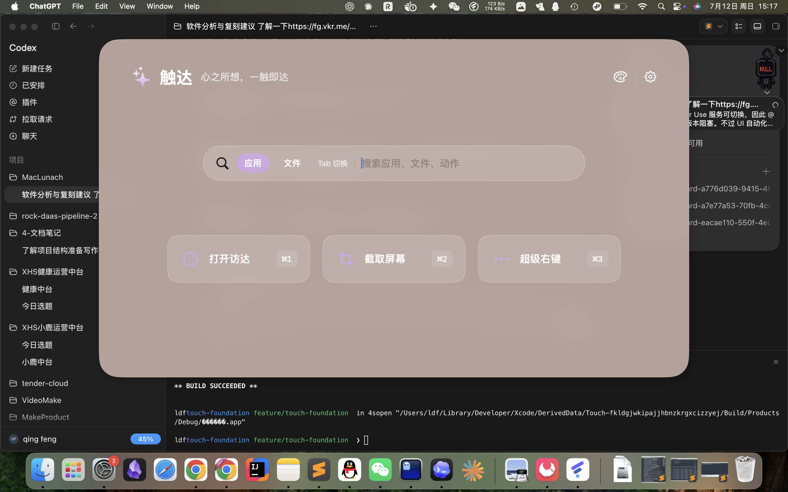
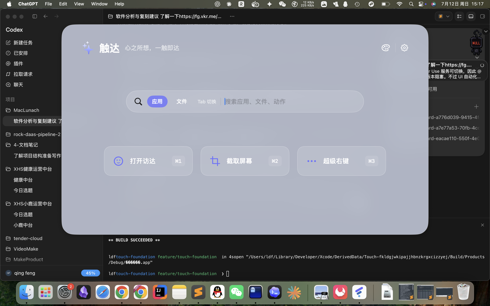
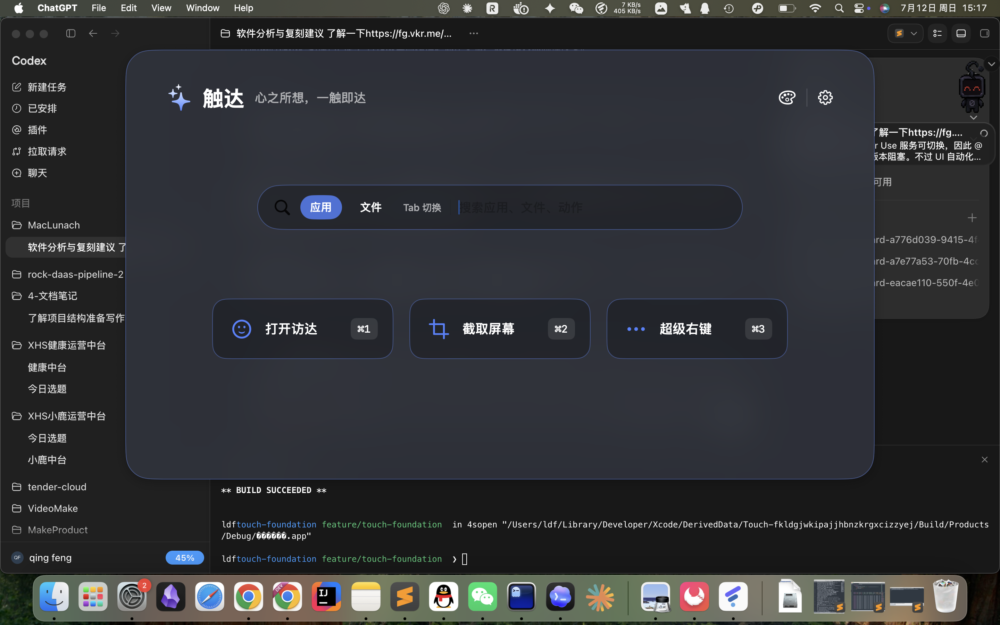

# 阶段一：启动器基础验收记录

## 状态

自动化质量门槛已全部通过；阶段一仍等待 @电脑 实操验收。当前 Computer Use 辅助程序与 macOS 15.3 的 Swift 运行时不兼容，无法启动本机控制通道。

## 验收环境

- 设备：MacBook Air（MacBookAir10,1），Apple M1，16 GB 内存
- 系统：macOS 15.3（24D60）
- Xcode：16.4（16F6）
- Swift：6.1.2
- 统一部署目标：macOS 14.0
- 阶段基线提交：`ea4a87f`

## 已通过项目

| 项目 | 命令或证据 | 结果 |
| --- | --- | --- |
| 部署目标一致性 | `Scripts/check-deployment-targets.sh` | macOS 14.0 一致 |
| 核心单元测试 | `swift test --package-path Packages/TouchKit` | 12 项通过 |
| Debug 构建 | `xcodebuild ... build` | 通过 |
| Release 构建 | `xcodebuild ... -configuration Release ... build` | 通过，arm64 + x86_64 |
| 设置三级导航 | `SettingsNavigationTests` | 通过 |
| 启动页、Tab 与查询保留 | `LauncherSmokeTests` | 通过 |
| 卡片右键入口 | `LauncherSmokeTests` | 通过 |
| 呼出性能 | `Scripts/measure-launcher.sh` | P50 1.528ms，P95 2.267ms |
| 降低透明度与 VoiceOver 标签 | `LauncherSmokeTests.testLauncherControlsExposeLabelsWithReducedTransparency` | 通过 |
| 减少动态效果 | `accessibilityReduceMotion` | 拖动排序禁用弹簧动画 |
| 三主题视觉截图 | `LauncherSmokeTests.testCaptureThreeThemeSnapshots` | 通过，见下方图片 |
| 完整 UI 回归 | `xcodebuild ... -resultBundlePath /tmp/touch-phase1.xcresult test` | 5 项通过 |

## 三主题截图

## 待完成证据

- @电脑实操验收尚未完成。`SkyComputerUseService` 在 macOS 15.3 上因缺少 `_swift_task_addPriorityEscalationHandler` 启动即崩溃；需更新为支持 macOS 15 的 Computer Use 组件后重试。

## 当前阶段边界

- “打开访达”执行真实 Finder 打开动作。
- “截取屏幕”和“超级右键”仍明确显示需要设置/后续阶段接入，不宣称功能已完成。
- 阶段一只验收启动器基础、主题、功能区管理、插件隔离、设置导航、快捷键和性能。

## 已知非阻塞限制

- 开发构建未使用 Developer ID 签名；最终分发阶段再完成签名、公证和 DMG。
- 当前只在 macOS 15.3 实机执行；macOS 14 由统一部署目标和构建检查覆盖，后续仍需独立实机回归。
